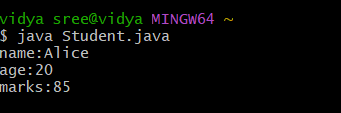

# java-lab-cse-g-5ef-2c
# experiment-2c
# construct implementation 
source code 
java 
```

class Student{
String name;
int age;
int marks;
Student(String n , int a,int m){
name=n;
age = a;
marks = m;}
void display(){
System.out.println("name:"+name);
System.out.println("age:"+age);
System.out.println("marks:"+marks);
}
public static void main (String[]args){
Student s1=new Student("Alice" , 20 , 85);
s1.display();
}
}

```
# OUTPUT: 

